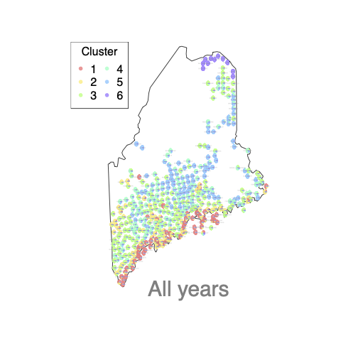

# Maine.Elections
DMM model for Maine referendum data

This project is an application of Dirichlet-multinomial mixture models (DMMs) to referendum data, starting with Maine's as a guiding example but expanding to other cases (Swiss referendum, American election data). The idea is that political behavior at the level of referendum is not the result of rational debates but the result of culturally-determined topographies of ideology. In this model, there are finite (but unknown) number of political cultures, each one of which specifies a distribution of support for each referendum question. Each municipality is then treated as a mixture of these cultures. The inferrential work of the model is then to recover: the number of ideologies, the distribution of support for each question and each ideology, and the mixture within each municipality. 

### Goals
There are several goals to this project. The first is to see if using DMMs in the context can provide a new framework for understanding longitudinal election data, much as similar models have done in genetics and document analysis. The second is to understand how widely this framework can be employed in political science. Does it always work well for all referendum questions? Does it work well for referendums but not other elections? A third goal is how to further develop the current DMM approach to allow for covariates (like a mixture of experts model) and to allow for more complex temporal structure. 

### BD-CTMC for inferring K

An innovation in this approach relative to other methods is that I've employed the Birth-death continuous-time Markov chain approach to inferring the the number of political cultures ($K$). This provides a clean posterior distribution of the number of components in the model and allows calculations on other parameters to integrate over uncertainty in the number of components.

## Current location

As of today (June 3, 2022), I have written an initial set of code (the main branch of this repository) that implements a DMM that allows for the slightly unusual structure of political data. I've run this code on many permutations of the data (different years, different questions) and am reasonably satisfied that the code is converging and performing well on the Maine data set. I've performed exploratory steps in analyzing the Swiss and American data and have implemented a fixed-K version of the mixture of experts extension.

Here's what the current model produces for the Maine data: .

## Next steps

Thinngs I'm currently working on:

* Swiss referendum data
* American election data
* Mixture of experts model for covariates
* Modelling the temporal structure with the data.

## The topology and differential geometry of political latent space

There are some very interesting (well, interesting to me) questions raised about what the results of the model are telling us about the structure of political cultures. Are two political cultures separate (in a topological sense) or do they exist along a gradient? This is both an interesting political science question (What does it mean if cultures are separated? Does that contribute to polarization?) as well as a statistical one. Down the road, I'm hoping to use the mixture model approach to take on these topological data analysis type questions. 

